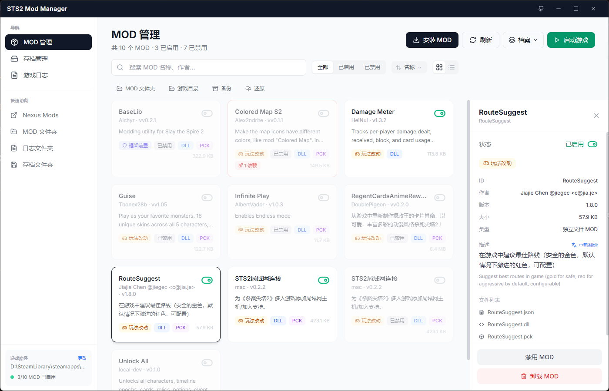
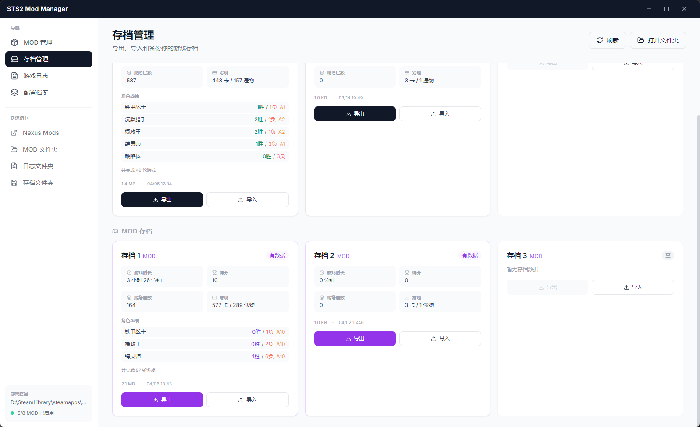

<div align="center">

# 🃏 STS2 Mod Manager

**给杀戮尖塔 2 玩家的 MOD 管理工具**

不用再手动复制文件夹了。装、删、开、关，拖进来就完事。

[](https://github.com/ImogeneOctaviap794/sts2-mod-manager/releases)
[](https://github.com/ImogeneOctaviap794/sts2-mod-manager)
[](LICENSE)

<br>



<br><br>



</div>

<br>

---

<br>

## ✨ 亮点

| | 功能 | 说明 |
|---|---|---|
| 📦 | **MOD 管理** | 安装 / 卸载 / 启用 / 禁用，支持拖拽 `.zip` `.rar` 直接安装 |
| �️ | **风险信号** | 自动标出缺失依赖、区分框架前置 / 玩法改动 / 资源类 MOD，一眼看清能不能安全启用 |
| 🔗 | **依赖跳转** | 详情面板中点击依赖项直接跳转到对应 MOD |
| 🔀 | **智能排序** | 按名称 / 依赖问题优先 / 影响玩法 / 分类 / 大小排序 |
| 🖼️ | **双视图模式** | 卡片网格视图（默认）和双栏列表视图随时切换 |
| 🧭 | **首次引导** | 3 步卡片式引导流程：选目录 → 装 MOD → 启动验证，新手友好 |
| ⚠️ | **操作确认** | 卸载、批量卸载、应用配置、还原备份等风险操作弹出确认，说明后果再执行 |
| �💾 | **存档管理** | 普通存档 & MOD 存档分开展示，一键导出备份、导入还原 |
| 📋 | **游戏日志** | 实时查看最新日志，出问题秒定位 |
| 🔍 | **崩溃分析** | 游戏退出后自动扫日志，精确到哪个 MOD 炸了 |
| 🌐 | **MOD 翻译** | 英文描述看不懂？一键翻译成中文 |
| ⚙️ | **配置档案** | 保存 MOD 启用方案，联机 / 单机随时切换 |
| 🚀 | **启动游戏** | Steam 正版、非 Steam 版都支持，自动识别 |

<br>

## 📥 下载

👉 [**点这里下载最新版**](https://github.com/ImogeneOctaviap794/sts2-mod-manager/releases)

> 安装包约 4MB，内置 WebView2 引导。Win10 / Win11 直接运行。

<br>

## 🚀 上手

1. 双击打开，管理器会自动找到你的游戏
2. 找不到？左下角点一下手动选目录，只需选一次
3. 装 MOD — 点「安装 MOD」选文件，或者**直接拖进窗口**
4. 开玩

<br>

## 🛠 本地开发

```bash
npm install              # 装依赖
npm run tauri:dev        # Tauri 开发模式
npm run tauri:build      # Tauri 打包
npm run dev              # Electron 开发模式
```

> Tauri 打包需要 [Rust](https://rustup.rs/) + [VS Build Tools](https://visualstudio.microsoft.com/visual-cpp-build-tools/)（勾选 C++ 桌面开发）

<br>

## 📐 技术栈

```
前端    React 18 + TailwindCSS + Lucide Icons
后端    Rust (Tauri v2)
打包    NSIS 安装包 (~4MB)
备选    Electron 版本代码也保留着
```

<br>

## 📁 项目结构

```
src/              前端源码 (React)
src-tauri/        后端源码 (Rust)
dist-tauri/       前端构建产物
main.js           Electron 主进程
preload.js        Electron 预加载
docs/             截图素材
```

<br>

---

<div align="center">
<sub>MIT License · 给个 ⭐ 就是最大的支持</sub>
</div>
